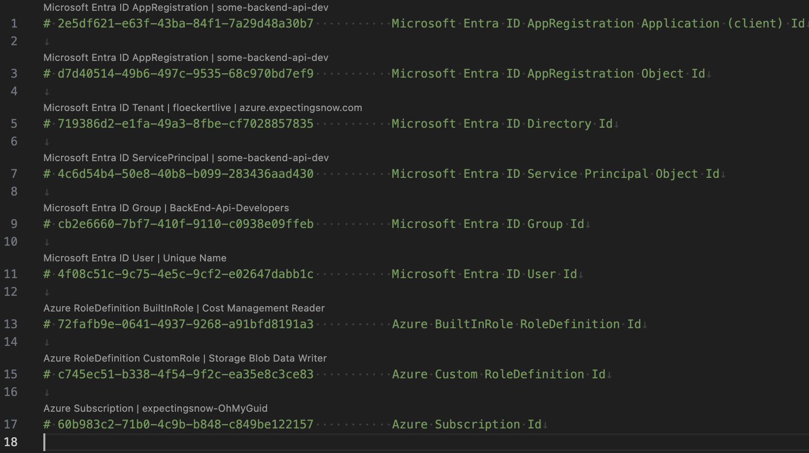

# ohmyguid

This extension provides CodeLens support for guids within text files by looking up
- Microsoft Entra Id AppRegistrations Ids
- Microsoft Entra Id AppRegistrations ClientIds / AppIds
- Microsoft Entra Id ServicePrincipal Ids
- Microsoft Entra Id ServicePrincipal ClientIds / AppIds
- Microsoft Entra Id Group Ids
- Microsoft Entra Id User Ids
- Azure Subscription Ids
- Azure Management Group Ids
- Azure Policy Definition Ids
- Azure Role Definition Ids

in

- yaml
- bicep
- markdown
- json

files.

## Features

stay tuned...

## Telemetry

Telemetry collecting follows guidelines in [Telemetry extension authors guide](https://code.visualstudio.com/api/extension-guides/telemetry) using [@vscode/extension-telemetry](https://www.npmjs.com/package/@vscode/extension-telemetry).

Configure the `telemetry.telemetryLevel` in [user settings](vscode://settings/telemetry.telemetryLevel).
 

Dump of all Visual Studio Code telemetry on the command line with `code --telemetry`.

## Requirements

please log in with the Azure CLI

## Extension Settings

no settings are currently supported

## Known Issues

all feedback is welcome and appreciated at https://github.com/expecting-snow/ohmyguid/issues

## Release Notes

### 0.0.x

all is beta before 1.0

**Happy hacking!**
